# 🧩 Pemodelan Berorientasi Objek (UML)

Halaman ini mendokumentasikan perancangan sistem menggunakan diagram UML (*Unified Modeling Language*) untuk memvisualisasikan struktur, perilaku, dan interaksi dalam sistem.

---

## 1. Use Case Diagram
Diagram ini menggambarkan interaksi antara aktor (pengguna) dengan fungsionalitas sistem.

### 🎭 Aktor
*   **Pelanggan**: Pengguna yang memesan makanan via QR Code.
*   **Admin / Kasir**: Pengelola sistem, menu, dan pembayaran tunai.
*   **Staf Dapur**: Penanggung jawab produksi pesanan.

### 🖼️ Diagram

```mermaid
graph LR
    subgraph Actors
        C[👤 Pelanggan]
        A[👤 Admin / Kasir]
        K[👤 Staf Dapur]
    end

    subgraph System["Sistem Pemesanan QR"]
        UC1(Scan QR Code)
        UC2(Lihat Menu Digital)
        UC3(Kelola Keranjang)
        UC4(Checkout & Voucher)
        UC5(Bayar QRIS/Tunai)
        UC6(Lacak Status Pesanan)
        
        UC7(Login Admin)
        UC8(Manajemen Menu & Stok)
        UC9(Manajemen Voucher)
        UC10(POS - Kasir Manual)
        UC11(Konfirmasi Pembayaran)
        UC12(Laporan Penjualan)
        
        UC13(Lihat Antrian Pesanan)
        UC14(Update Status Pesanan)
    end

    C --> UC1
    C --> UC2
    C --> UC3
    C --> UC4
    C --> UC5
    C --> UC6

    A --> UC7
    A --> UC8
    A --> UC9
    A --> UC10
    A --> UC11
    A --> UC12

    K --> UC13
    K --> UC14
    
    %% Styling
    classDef actor fill:#f9f,stroke:#333,stroke-width:2px;
    classDef usecase fill:#fff,stroke:#333,stroke-width:1px,rx:20,ry:20;
    
    class C,A,K actor;
    class UC1,UC2,UC3,UC4,UC5,UC6,UC7,UC8,UC9,UC10,UC11,UC12,UC13,UC14 usecase;
```

### 📝 Deskripsi Use Case Utama
| Use Case | Aktor | Deskripsi |
| :--- | :--- | :--- |
| **Scan QR Code** | Pelanggan | Aktor memindai kode QR di meja untuk membuka aplikasi web. |
| **Checkout & Voucher** | Pelanggan | Aktor memfinalisasi pesanan dan memasukkan kode voucher diskon. |
| **Bayar (QRIS/Tunai)** | Pelanggan | Aktor memilih metode bayar. Jika QRIS, sistem generate kode bayar otomatis. |
| **Manajemen Menu** | Admin | Aktor menambah, mengedit, atau menghapus data menu dan stok. |
| **Update Status** | Staf Dapur | Aktor mengubah status pesanan dari "Pending" -> "Diproses" -> "Siap". |

---

## 2. Activity Diagram
Diagram ini menggambarkan alur kerja (workflow) dari proses bisnis utama: **Pemesanan oleh Pelanggan**.

---

## 3. Sequence Diagram
Diagram ini menggambarkan interaksi detail antar objek untuk skenario: **Pembayaran via QRIS**.

---

## 4. Class Diagram
Diagram ini menggambarkan struktur database dan relasi antar entitas (Model) dalam sistem.

