# Dapoer Katendjo - QR Ordering System

Sistem Pemesanan Menu Restoran Berbasis **QR Code** untuk restoran **Dapoer Katendjo**. Pelanggan memindai QR di meja, memesan langsung dari smartphone, membayar secara digital, dan pesanan masuk otomatis ke dashboard dapur secara real-time.


> Ganti `YOUR_USERNAME/YOUR_REPO` pada badge CI dengan username & nama repositori GitHub kamu setelah di-push.

---

## Fitur Utama

- **Pemesanan via QR** - Scan QR per meja → lihat menu digital → pesan → bayar
- **Multi-Role Dashboard** - Admin, Kasir, Dapur, dan Pelanggan
- **Pembayaran Digital** - Integrasi Midtrans Snap (QRIS, GoPay, OVO, DANA, ShopeePay, Transfer Bank, Kartu)
- **Real-time Order Tracking** - Status pesanan live dari dapur ke pelanggan (Pusher/Broadcast)
- **Login OTP WhatsApp** - Autentikasi pelanggan via nomor WhatsApp + OTP (Fonnte API)
- **Manajemen Menu & Kategori** - CRUD lengkap dengan gambar, harga, dan stok
- **Sistem Voucher** - Kode promo diskon persentase/nominal dengan kuota & minimum belanja
- **QR Code Generator** - Generate QR unik untuk setiap nomor meja
- **POS (Point of Sale)** - Input pesanan manual untuk pelanggan walk-in
- **Laporan Penjualan** - Rekap pendapatan dan pesanan harian/mingguan/bulanan
- **Cetak Struk** - Print receipt dari dashboard admin/kasir

## Peran Pengguna

| Role | Akses |
|------|-------|
| **Admin** | Dashboard, manajemen menu/kategori, QR meja, voucher, pelanggan, laporan |
| **Kasir** | POS, verifikasi pembayaran tunai, cetak struk |
| **Dapur (Kitchen)** | Dashboard pesanan real-time, update status (Proses → Siap → Selesai) |
| **Pelanggan** | Menu digital, keranjang, checkout, tracking pesanan, voucher |

Login: Admin/Kasir/Dapur memakai **email + password**, Pelanggan memakai **nomor WhatsApp + OTP**.

## Tampilan (Screenshot)

### Alur Pelanggan

**1. Scan QR** — halaman awal pemindaian QR meja
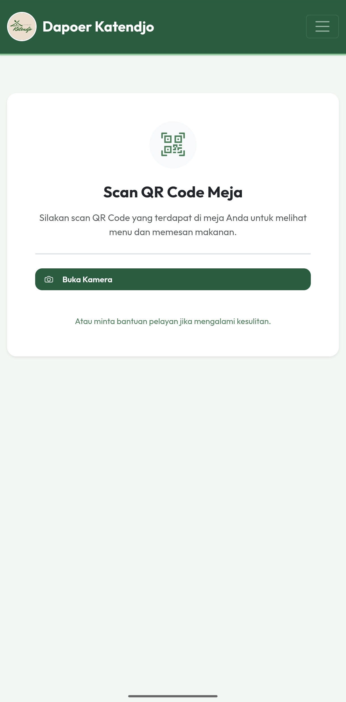

**2. Menu Digital** — daftar menu, kategori, dan harga
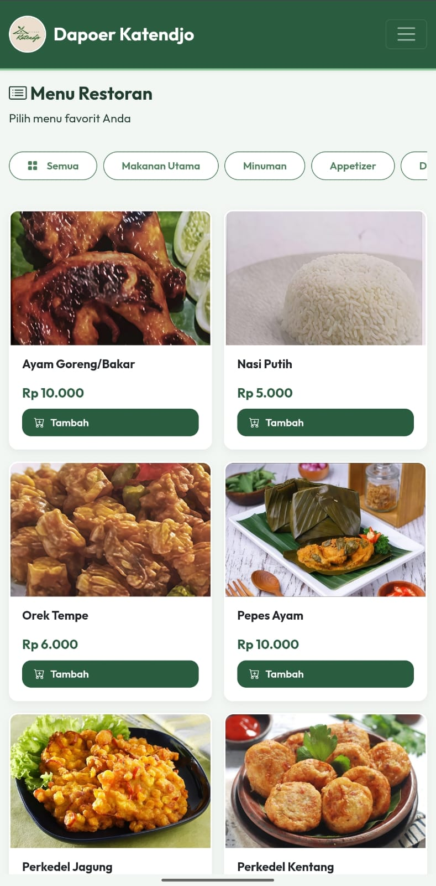

**3. Keranjang** — item yang dipilih sebelum checkout
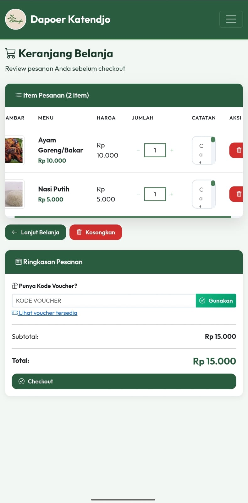

**4. Pembayaran** — pembayaran QRIS
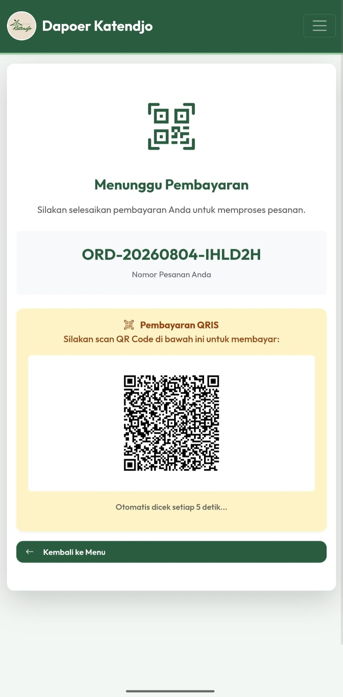

**5. Pesanan Berhasil** — nomor order setelah checkout
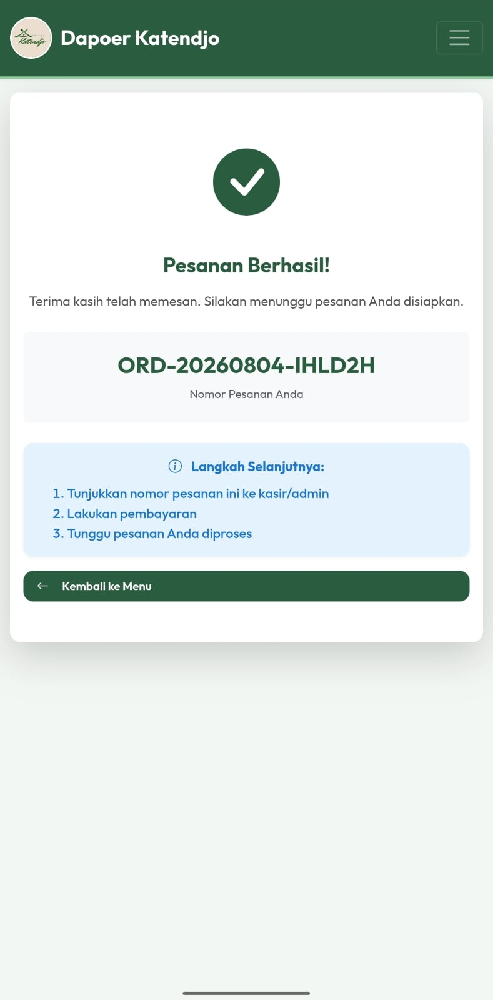

**6. Riwayat Pesanan**
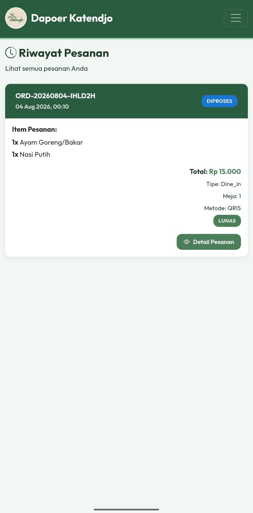

### Alur Admin

**1. Dashboard** — statistik penjualan
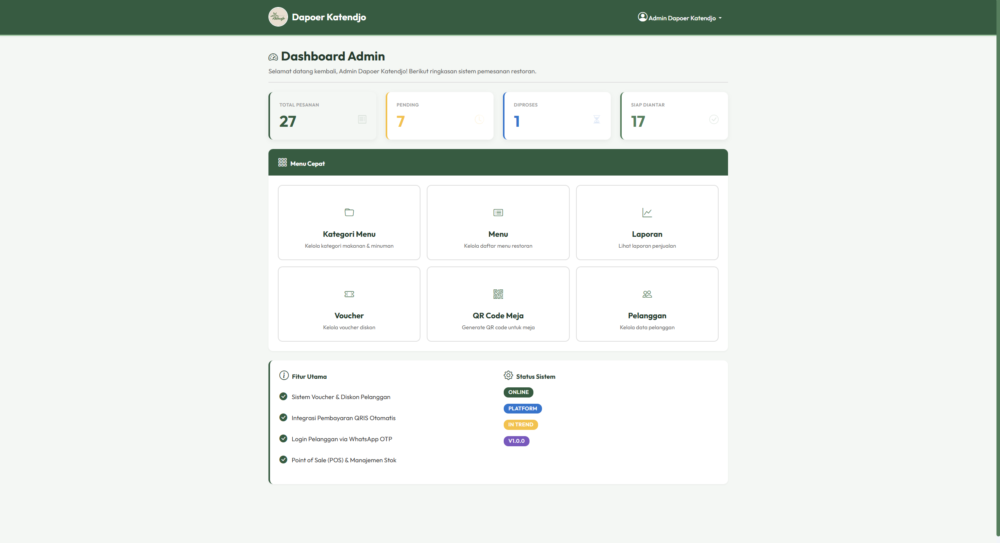

**2. Manajemen Menu**
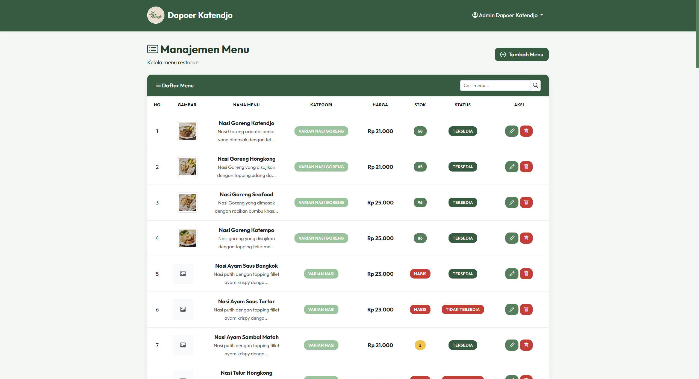

**3. Tambah Menu**
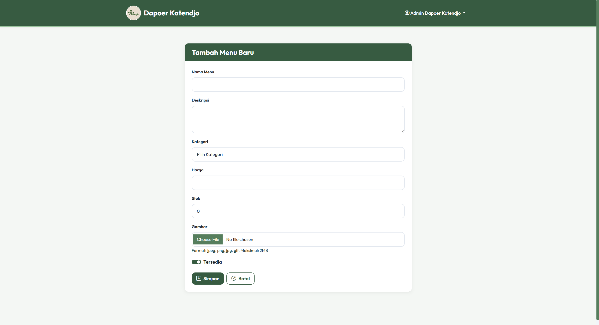

**4. QR Code Meja**
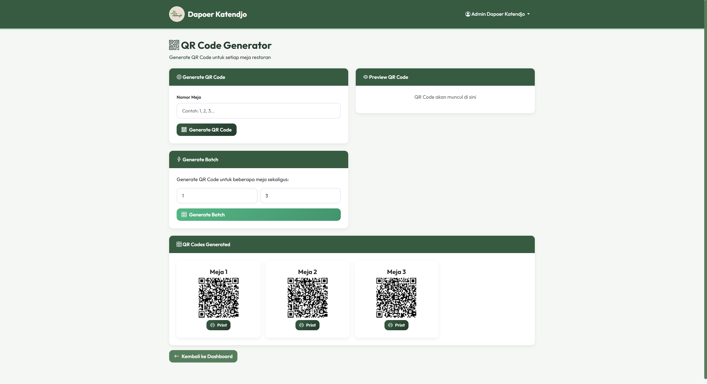

**5. Manajemen Voucher**
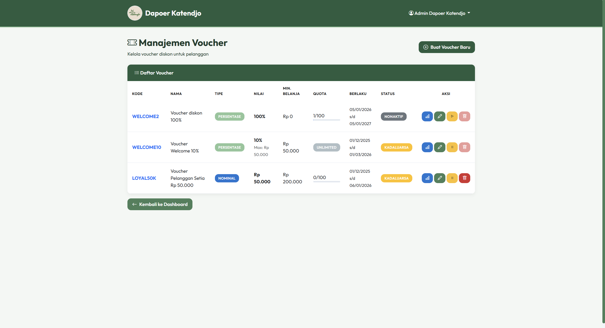

**6. Laporan Penjualan**
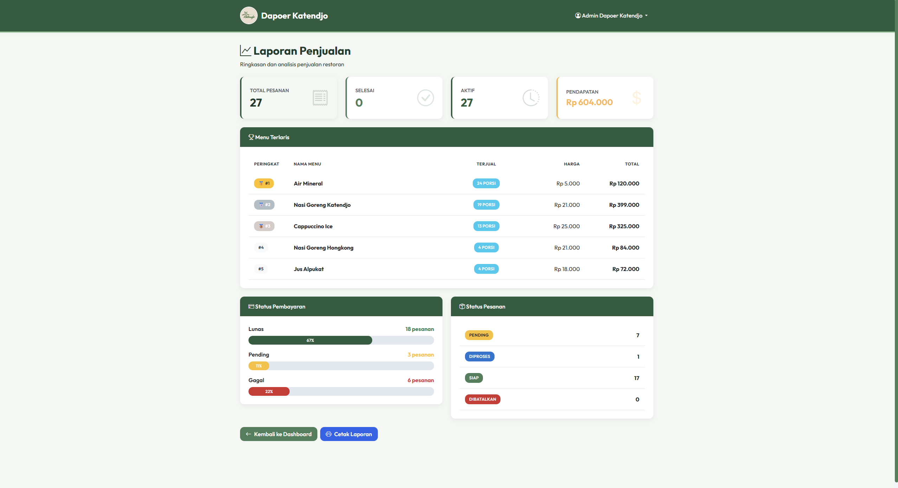

### Alur Kasir

**1. Dashboard Kasir**
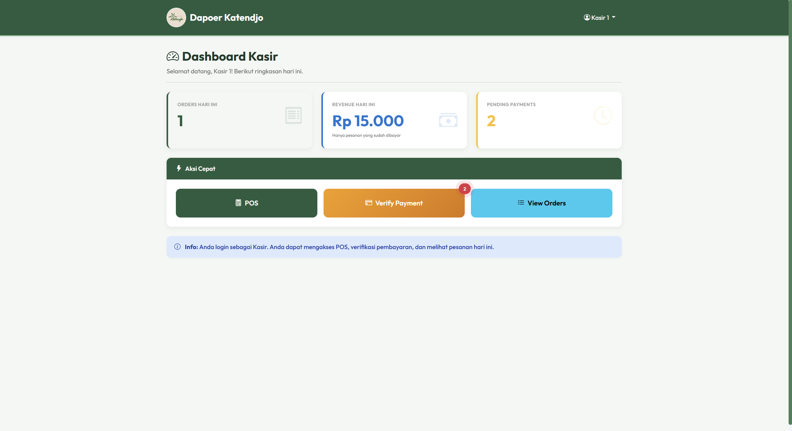

**2. POS** — input pesanan manual
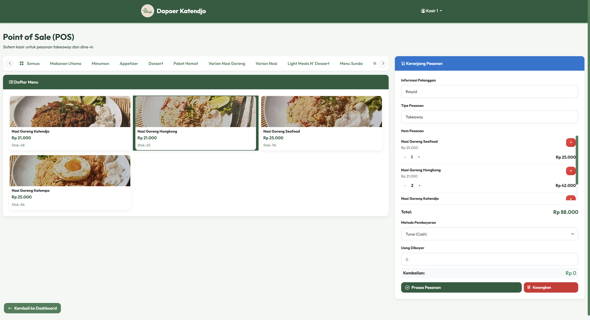

**3. Verifikasi Pembayaran QR**
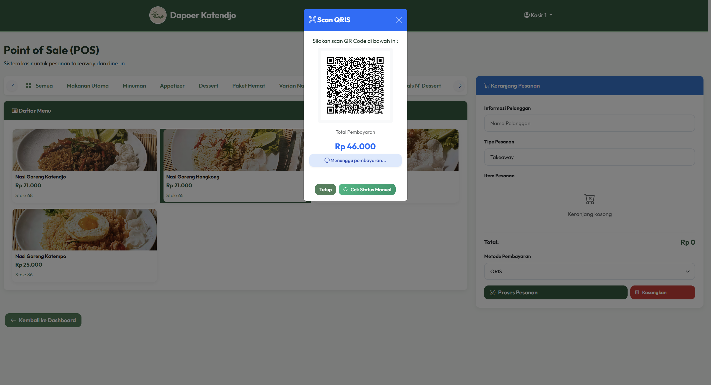

**4. Pesanan Berhasil**
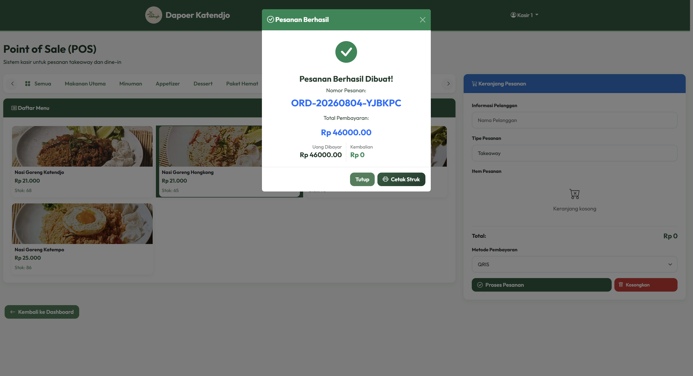

**5. Cetak Struk**
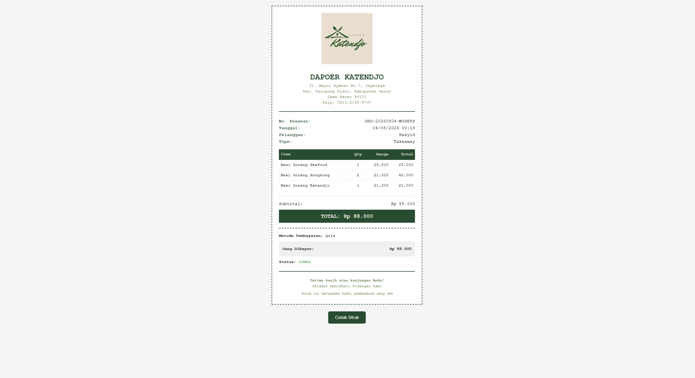

### Alur Dapur

**1. Dashboard Dapur** — antrian pesanan real-time
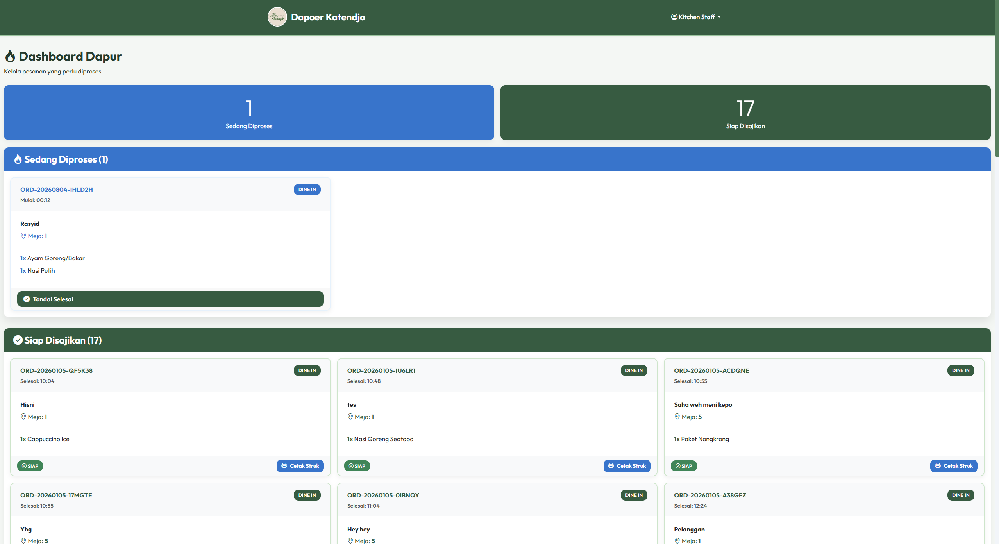

## Demo Live

> **Belum tersedia.** Isi link di bawah setelah deploy (panduan: [`docs/6_DEPLOYMENT_RENDER.md`](./docs/6_DEPLOYMENT_RENDER.md)).

🔗 [https://your-app.onrender.com](https://your-app.onrender.com)

## Teknologi

| Komponen | Teknologi |
|----------|-----------|
| Backend | Laravel 12 (PHP 8.3+) |
| Frontend | Blade + Bootstrap 5.3 + Tailwind CSS (via Vite) |
| Database | SQLite (dev) / MySQL / PostgreSQL (prod) |
| Payment | Midtrans Snap API |
| OTP/WhatsApp | Fonnte API |
| QR Code | SimpleSoftwareIO/simple-qrcode |
| Realtime | Pusher + Laravel Echo |
| Build Tool | Vite |

## Struktur Proyek

```
akpl/
├── app/
│   ├── Events/                 # Event domain (mis. OrderStatusUpdated)
│   ├── Http/
│   │   ├── Controllers/        # Admin, Cashier, Customer, Kitchen, Auth, QR, Voucher, PaymentCallback
│   │   └── Middleware/         # RoleMiddleware, PreventKitchenAccess, RedirectIfAuthenticated
│   ├── Models/                 # User, Category, Menu, Order, OrderItem, Voucher, VoucherUsage
│   ├── Providers/
│   └── Services/               # FonnteService (OTP WhatsApp)
├── bootstrap/                  # Bootstrap aplikasi & middleware
├── config/                     # Konfigurasi Laravel
├── database/
│   ├── factories/
│   ├── migrations/             # Skema tabel (users, menus, orders, vouchers, dll.)
│   └── seeders/                # User, Category, Menu, Voucher seeder
├── docs/                       # Dokumentasi lengkap (lihat indeks di bawah)
├── public/                     # Entry point & asset publik
├── resources/
│   ├── css/                    # app.css (Tailwind v4)
│   ├── js/                     # app.js, bootstrap.js (Laravel Echo)
│   └── views/                  # Blade template per role (admin, cashier, kitchen, customer, auth, qr)
├── routes/
│   ├── admin.php               # Semua route role-based
│   ├── console.php
│   └── web.php                 # Auth, webhook Midtrans, include admin.php
├── tests/                      # Pest test (Feature/Unit)
├── composer.json
├── package.json
├── phpunit.xml
└── vite.config.js
```

## Persyaratan

- PHP **8.3+** (toolchain test — Pest 4 / PHPUnit 12 — butuh PHP ≥ 8.3)
- Composer
- Node.js & NPM
- SQLite (default, sudah tersedia di `database/database.sqlite`) atau MySQL/PostgreSQL

## Instalasi Lokal

```bash
# 1. Install dependency
composer install
npm install

# 2. Siapkan environment
copy .env.example .env   # (Windows) / cp .env.example .env (Linux/macOS)
php artisan key:generate

# 3. Set konfigurasi di .env
#    DB_CONNECTION=sqlite
#    MIDTRANS_SERVER_KEY=...     (opsional untuk payment)
#    MIDTRANS_CLIENT_KEY=...
#    FONNTE_TOKEN=...            (opsional untuk OTP WhatsApp)

# 4. Migrasi & seed data awal
php artisan migrate --seed

# 5. Jalankan server (3 terminal / pakai composer dev)
composer run dev
# atau secara manual:
#   php artisan serve
#   php artisan queue:listen --tries=1
#   npm run dev
```

Akses aplikasi di `http://localhost:8000`.

### Akun Default (Seeder)

| Role | Email | Password |
|------|-------|----------|
| Admin | `admin@dapoerkatendjo.com` | `password` |
| Kasir | `cashier@dapoerkatendjo.com` | `password` |
| Dapur | `kitchen@dapoerkatendjo.com` | `password` |
| Pelanggan | `customer@akpl.com` | `password` |

> ⚠️ **Akun di atas hanya untuk demo/lokal.** Ganti password & email default sebelum dipakai di produksi.
>
> Jalankan seeder: `php artisan db:seed`

## Menjalankan Test

Proyek menggunakan **Pest**:

```bash
composer test                 # php artisan test (semua test)
php artisan test --filter=AdminFeatures
php artisan test --parallel   # lebih cepat
```

Alternatif interaktif: `.\run-tests.ps1`

> **CI:** GitHub Actions (`.github/workflows/ci.yml`) otomatis menjalankan test (PHP 8.2–8.4), build asset (Vite), dan cek code style (Pint) pada setiap push/PR.

## Deployment

Panduan lengkap deploy ke **Render.com** (gratis) ada di [`docs/6_DEPLOYMENT_RENDER.md`](./docs/6_DEPLOYMENT_RENDER.md). Konfigurasi disertakan pada [`render.yaml`](./render.yaml).

## Dokumentasi Lainnya

Indeks lengkap dokumentasi ada di [`docs/README.md`](./docs/README.md):

1. [Overview Project](./docs/1_OVERVIEW_PROJECT.md)
2. [Rekayasa Kebutuhan](./docs/2_REKAYASA_KEBUTUHAN.md)
3. [Daftar Kebutuhan](./docs/3_DAFTAR_KEBUTUHAN.md)
4. [Dokumentasi Notion](./docs/4_DOKUMENTASI_NOTION.md)
5. [UML Diagrams (Mermaid)](./docs/5_UML_DIAGRAMS_MERMAID.md)
6. [Panduan Deploy Render](./docs/6_DEPLOYMENT_RENDER.md)

## Lisensi

Proyek ini dikembangkan untuk kebutuhan akademik **Kelompok 4** dengan klien Dapoer Katendjo.
