# UML Diagrams - Sistem Pemesanan Restoran Berbasis QR (Dapoer Katendjo)

Dokumen ini berisi diagram UML utama untuk sistem: **Use Case Diagram**, **Activity Diagram**, dan **Sequence Diagram**.

---

## 1. Use Case Diagram

Diagram ini menggambarkan interaksi antara 3 aktor utama (Pelanggan, Admin, Staf Dapur) dengan fitur-fitur sistem.

```mermaid
graph LR
    subgraph Actors
        C[👤 Pelanggan]
        A[👤 Admin / Kasir]
        K[👤 Staf Dapur]
    end

    subgraph System["Sistem Pemesanan QR"]
        UC1(Scan QR Code)
        UC2(Lihat Menu Digital)
        UC3(Kelola Keranjang)
        UC4(Checkout Pesanan)
        UC5(Gunakan Voucher)
        UC6(Bayar QRIS/Tunai)
        UC7(Lacak Status Pesanan)
        
        UC8(Login Admin)
        UC9(Manajemen Menu & Kategori)
        UC10(Manajemen Voucher)
        UC11(POS - Kasir Manual)
        UC12(Konfirmasi Pembayaran Tunai)
        UC13(Lihat Laporan)
        
        UC14(Lihat Antrian Pesanan)
        UC15(Update Status Pesanan)
    end

    C --> UC1
    C --> UC2
    C --> UC3
    C --> UC4
    C --> UC5
    C --> UC6
    C --> UC7

    A --> UC8
    A --> UC9
    A --> UC10
    A --> UC11
    A --> UC12
    A --> UC13

    K --> UC14
    K --> UC15
    
    %% Styling
    classDef actor fill:#f9f,stroke:#333,stroke-width:2px;
    classDef usecase fill:#fff,stroke:#333,stroke-width:1px,rx:20,ry:20;
    
    class C,A,K actor;
    class UC1,UC2,UC3,UC4,UC5,UC6,UC7,UC8,UC9,UC10,UC11,UC12,UC13,UC14,UC15 usecase;
```

---

## 2. Activity Diagrams

### A. Alur Pemesanan Pelanggan (Customer Ordering Flow)

Menggambarkan langkah-langkah pelanggan dari scan QR hingga pesanan diterima.

### B. Alur Operasional Dapur (Kitchen Workflow)

Menggambarkan bagaimana dapur memproses pesanan yang masuk.

---

## 3. Sequence Diagrams

### A. Skenario: Pemesanan dengan Pembayaran QRIS

Detail interaksi antar objek saat pelanggan memesan dan membayar via QRIS.

### B. Skenario: Penggunaan Voucher

Detail validasi saat pelanggan memasukkan kode voucher.

---

## 4. Class Diagram

Diagram ini menggambarkan struktur database dan relasi antar model dalam sistem.

