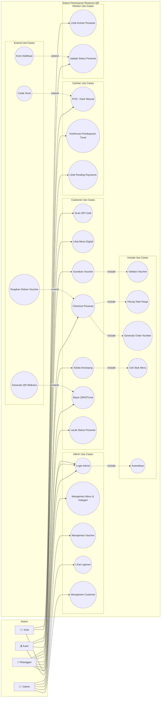
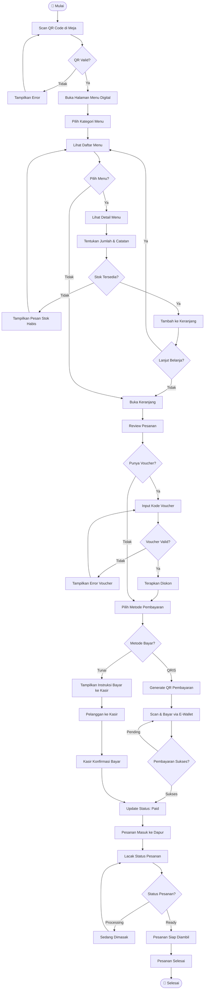
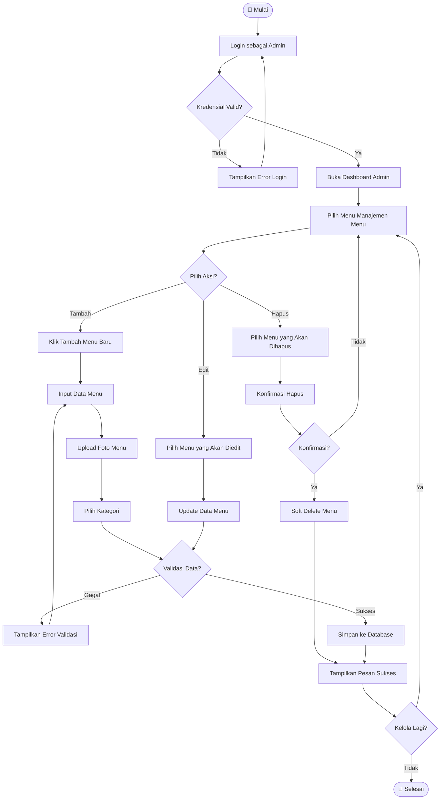
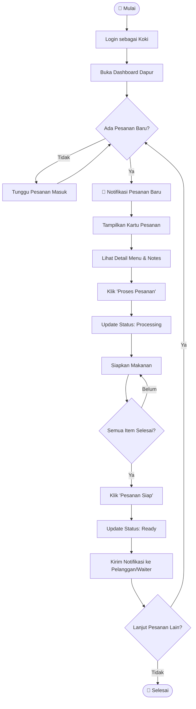
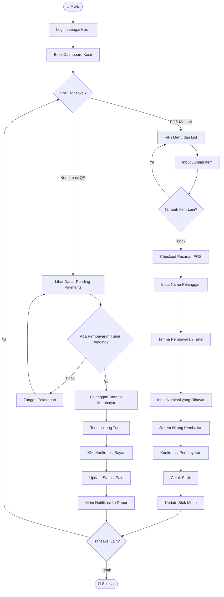
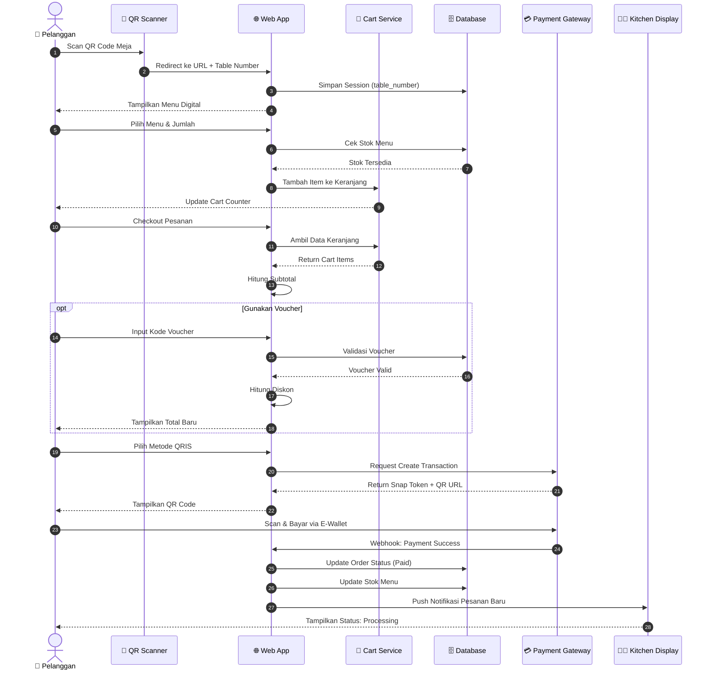
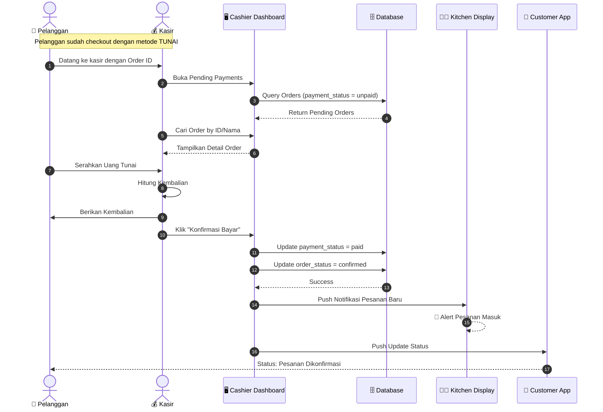
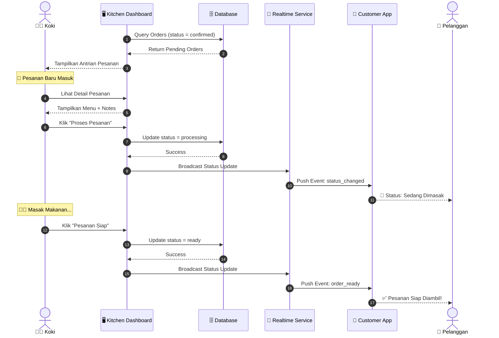
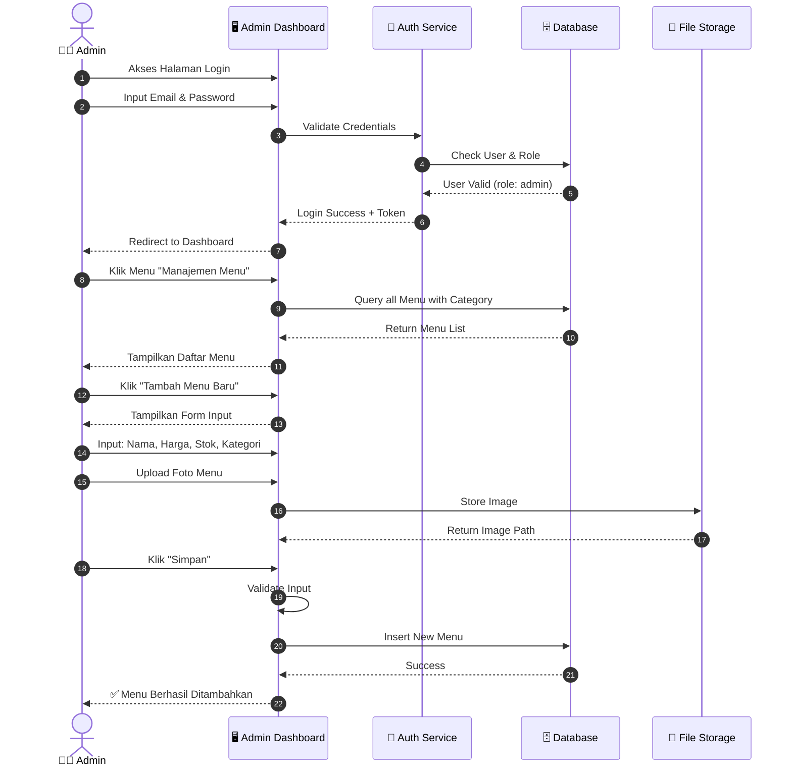
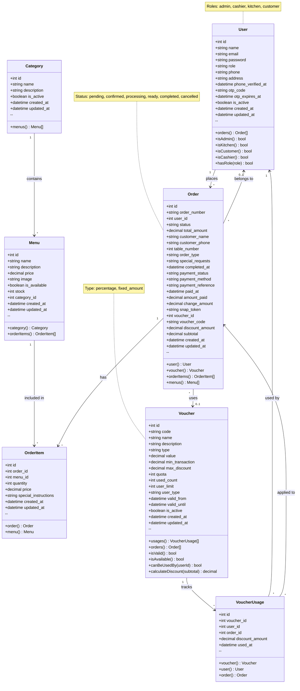

# UML Diagrams - Sistem Pemesanan Menu QR (Dapoer Katendjo)

Dokumen ini berisi semua diagram UML dalam format **Mermaid** untuk Sistem Pemesanan Restoran QR.

---

## 📋 Daftar Isi

1. [Use Case Diagram](#1-use-case-diagram)
2. [Activity Diagram Utama](#2-activity-diagram-utama)
3. [Sequence Diagram Utama](#3-sequence-diagram-utama)
4. [Class Diagram](#4-class-diagram)

---

## 1. Use Case Diagram

### 🎯 Aktor dan Use Case Lengkap

Sistem ini memiliki **4 aktor** dan **17 use case** dengan relasi `<<include>>` dan `<<extend>>`.

### 📊 Tabel Ringkasan Aktor

| Aktor | Role | Jumlah Use Case | Use Case Utama |
|-------|------|-----------------|----------------|
| **Pelanggan** | End User | 7 | Scan QR, Pesan Menu, Bayar |
| **Admin** | Administrator | 5 | Kelola Menu, Voucher, Laporan |
| **Kasir** | Staff | 4 | POS Manual, Konfirmasi Bayar |
| **Koki** | Staff | 3 | Lihat Antrian, Update Status |

---

## 2. Activity Diagram Utama

### 2.1 Activity Diagram: Proses Pemesanan (Customer Flow)

### 2.2 Activity Diagram: Manajemen Menu (Admin)

### 2.3 Activity Diagram: Proses Dapur (Kitchen)

### 2.4 Activity Diagram: Proses Kasir

---

## 3. Sequence Diagram Utama

### 3.1 Sequence Diagram: Proses Pemesanan via QR

### 3.2 Sequence Diagram: Konfirmasi Pembayaran Tunai

### 3.3 Sequence Diagram: Update Status Pesanan (Dapur)

### 3.4 Sequence Diagram: Manajemen Menu (Admin)

---

## 4. Class Diagram

### 📊 Tabel Relasi Antar Class

| Class | Relasi | Class Target | Tipe | Keterangan |
|-------|--------|--------------|------|------------|
| User | hasMany | Order | 1:N | User dapat memiliki banyak pesanan |
| Category | hasMany | Menu | 1:N | Kategori memiliki banyak menu |
| Menu | belongsTo | Category | N:1 | Menu termasuk dalam satu kategori |
| Menu | hasMany | OrderItem | 1:N | Menu dapat dipesan berkali-kali |
| Order | belongsTo | User | N:1 | Pesanan milik satu user (opsional) |
| Order | belongsTo | Voucher | N:1 | Pesanan menggunakan satu voucher (opsional) |
| Order | hasMany | OrderItem | 1:N | Pesanan memiliki banyak item |
| OrderItem | belongsTo | Order | N:1 | Item termasuk dalam satu pesanan |
| OrderItem | belongsTo | Menu | N:1 | Item merujuk ke satu menu |
| Voucher | hasMany | VoucherUsage | 1:N | Voucher dapat digunakan berkali-kali |
| Voucher | hasMany | Order | 1:N | Voucher dapat dipakai di banyak order |
| VoucherUsage | belongsTo | Voucher | N:1 | Usage merujuk ke satu voucher |
| VoucherUsage | belongsTo | User | N:1 | Usage oleh satu user |
| VoucherUsage | belongsTo | Order | N:1 | Usage di satu order |

---

## 📝 Catatan Implementasi

### Status Order
- `pending` - Menunggu pembayaran
- `confirmed` - Pembayaran dikonfirmasi, masuk antrian dapur
- `processing` - Sedang dimasak
- `ready` - Pesanan siap diambil
- `completed` - Pesanan selesai
- `cancelled` - Pesanan dibatalkan

### Status Pembayaran
- `unpaid` - Belum dibayar
- `paid` - Sudah dibayar

### Metode Pembayaran
- `qris` - Pembayaran via QRIS/Midtrans
- `cash` - Pembayaran tunai di kasir

### Tipe Voucher
- `percentage` - Diskon persentase
- `fixed_amount` - Diskon nominal tetap

### User Roles
- `admin` - Full akses sistem
- `cashier` - Akses kasir dan POS
- `kitchen` - Akses dashboard dapur
- `customer` - Pelanggan terdaftar

---

## 🔗 Referensi File Terkait

- [USE_CASE_DIAGRAM_COMPLETE.md](./USE_CASE_DIAGRAM_COMPLETE.md) - Diagram Use Case lengkap format PlantUML
- [ACTIVITY_DIAGRAMS_COMPLETE.md](./ACTIVITY_DIAGRAMS_COMPLETE.md) - Activity Diagram per Use Case
- [DOCUMENTATION.md](./DOCUMENTATION.md) - Dokumentasi teknis lengkap

